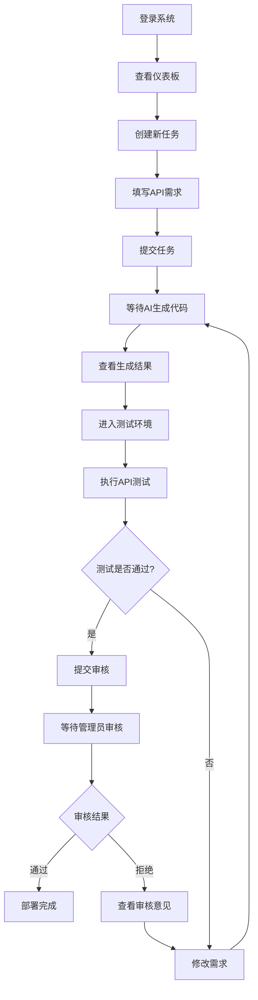
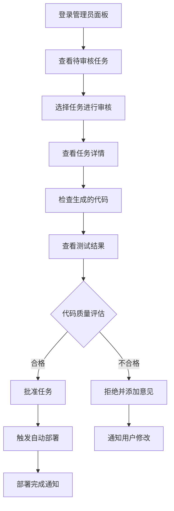

# AI API 开发自动化平台 - 前端页面功能详细设计文档

## 目录
1. [前端架构概述](#1-前端架构概述)
2. [页面功能详细设计](#2-页面功能详细设计)
3. [核心组件设计](#3-核心组件设计)
4. [用户交互流程](#4-用户交互流程)
5. [响应式设计方案](#5-响应式设计方案)
6. [状态管理设计](#6-状态管理设计)

---

## 1. 前端架构概述

### 1.1 技术栈
- **框架**: React 18 + TypeScript
- **状态管理**: Zustand
- **UI组件库**: Ant Design 5.x
- **路由管理**: React Router v6
- **HTTP客户端**: Axios
- **构建工具**: Vite
- **代码高亮**: react-syntax-highlighter
- **图表库**: ECharts for React
- **样式方案**: Tailwind CSS + Ant Design

### 1.2 项目结构
```
src/
├── pages/                    # 页面组件
│   ├── auth/                # 认证相关页面
│   │   ├── Login.tsx        # 登录页面
│   │   └── Register.tsx     # 注册页面
│   ├── dashboard/           # 仪表板页面
│   │   └── Dashboard.tsx    # 主仪表板
│   ├── task/                # 任务相关页面
│   │   ├── TaskSubmit.tsx   # 任务提交页面
│   │   ├── TaskList.tsx     # 任务列表页面
│   │   └── TaskDetail.tsx   # 任务详情页面
│   ├── test/                # 测试相关页面
│   │   └── TestEnvironment.tsx # 测试环境页面
│   ├── notification/        # 通知相关页面
│   │   └── NotificationCenter.tsx # 通知中心
│   └── admin/               # 管理员页面
│       ├── AdminPanel.tsx   # 管理员面板
│       ├── UserManagement.tsx # 用户管理
│       └── SystemSettings.tsx # 系统设置
├── components/              # 公共组件
├── hooks/                   # 自定义Hooks
├── store/                   # 状态管理
├── utils/                   # 工具函数
├── types/                   # TypeScript类型定义
└── styles/                  # 样式文件
```

---

## 2. 页面功能详细设计

### 2.1 认证页面

#### 2.1.1 登录页面 (Login.tsx)

**页面功能**:
- 用户身份验证
- 记住登录状态
- 密码找回入口
- 注册页面跳转

**界面设计**:
```tsx
// 页面布局
<div className="min-h-screen bg-gradient-to-br from-blue-50 to-indigo-100">
  <div className="flex items-center justify-center min-h-screen">
    <Card className="w-96 shadow-2xl">
      <div className="text-center mb-8">
        <h1 className="text-3xl font-bold text-gray-800">AI API 开发平台</h1>
        <p className="text-gray-600 mt-2">让API开发变得简单</p>
      </div>
      
      <Form onFinish={handleLogin}>
        <Form.Item name="username" rules={[{ required: true }]}>
          <Input 
            prefix={<UserOutlined />} 
            placeholder="用户名" 
            size="large"
          />
        </Form.Item>
        
        <Form.Item name="password" rules={[{ required: true }]}>
          <Input.Password 
            prefix={<LockOutlined />} 
            placeholder="密码" 
            size="large"
          />
        </Form.Item>
        
        <Form.Item>
          <div className="flex justify-between items-center">
            <Checkbox>记住我</Checkbox>
            <a href="#" className="text-blue-600">忘记密码？</a>
          </div>
        </Form.Item>
        
        <Form.Item>
          <Button 
            type="primary" 
            htmlType="submit" 
            size="large" 
            block 
            loading={loading}
          >
            登录
          </Button>
        </Form.Item>
        
        <div className="text-center">
          <span className="text-gray-600">还没有账号？</span>
          <a href="/register" className="text-blue-600 ml-1">立即注册</a>
        </div>
      </Form>
    </Card>
  </div>
</div>
```

**核心功能**:
1. **表单验证**: 实时验证用户输入
2. **登录状态管理**: JWT token存储和管理
3. **错误处理**: 友好的错误提示
4. **加载状态**: 登录过程中的loading效果

#### 2.1.2 注册页面 (Register.tsx)

**页面功能**:
- 新用户注册
- 邮箱验证
- 密码强度检测
- 用户协议确认

**特色功能**:
- 实时密码强度指示器
- 邮箱格式验证
- 用户名重复检查
- 图形验证码

### 2.2 仪表板页面 (Dashboard.tsx)

**页面功能**:
- 系统概览数据展示
- 快速操作入口
- 最近任务状态
- 系统通知展示

**布局设计**:
```tsx
<div className="p-6 bg-gray-50 min-h-screen">
  {/* 顶部统计卡片 */}
  <Row gutter={[16, 16]} className="mb-6">
    <Col span={6}>
      <StatisticCard 
        title="总任务数" 
        value={totalTasks} 
        icon={<FileTextOutlined />}
        color="#1890ff"
      />
    </Col>
    <Col span={6}>
      <StatisticCard 
        title="进行中" 
        value={activeTasks} 
        icon={<LoadingOutlined />}
        color="#52c41a"
      />
    </Col>
    <Col span={6}>
      <StatisticCard 
        title="已完成" 
        value={completedTasks} 
        icon={<CheckCircleOutlined />}
        color="#722ed1"
      />
    </Col>
    <Col span={6}>
      <StatisticCard 
        title="待审核" 
        value={pendingTasks} 
        icon={<ClockCircleOutlined />}
        color="#fa8c16"
      />
    </Col>
  </Row>
  
  {/* 主要内容区域 */}
  <Row gutter={[16, 16]}>
    {/* 左侧：快速操作和最近任务 */}
    <Col span={16}>
      <Card title="快速操作" className="mb-4">
        <Space size="large">
          <Button 
            type="primary" 
            size="large" 
            icon={<PlusOutlined />}
            onClick={() => navigate('/task/submit')}
          >
            创建新任务
          </Button>
          <Button 
            size="large" 
            icon={<EyeOutlined />}
            onClick={() => navigate('/task/list')}
          >
            查看所有任务
          </Button>
          <Button 
            size="large" 
            icon={<ExperimentOutlined />}
            onClick={() => navigate('/test')}
          >
            测试环境
          </Button>
        </Space>
      </Card>
      
      <Card title="最近任务">
        <RecentTasksList tasks={recentTasks} />
      </Card>
    </Col>
    
    {/* 右侧：通知和系统状态 */}
    <Col span={8}>
      <Card title="系统通知" className="mb-4">
        <NotificationList notifications={notifications} />
      </Card>
      
      <Card title="系统状态">
        <SystemStatusIndicator />
      </Card>
    </Col>
  </Row>
</div>
```

**核心组件**:
1. **StatisticCard**: 统计数据卡片
2. **RecentTasksList**: 最近任务列表
3. **NotificationList**: 通知列表
4. **SystemStatusIndicator**: 系统状态指示器

### 2.3 任务管理页面

#### 2.3.1 任务提交页面 (TaskSubmit.tsx)

**页面功能**:
- API需求描述提交
- 参数定义和验证
- 数据库操作说明
- 预期输出格式定义

**表单设计**:
```tsx
<Card title="创建新的API任务" className="max-w-4xl mx-auto">
  <Form layout="vertical" onFinish={handleSubmit}>
    {/* 基本信息 */}
    <Card type="inner" title="基本信息" className="mb-4">
      <Form.Item 
        label="API名称" 
        name="title" 
        rules={[{ required: true, message: '请输入API名称' }]}
      >
        <Input placeholder="例如：获取用户个人资料" />
      </Form.Item>
      
      <Form.Item 
        label="功能描述" 
        name="description" 
        rules={[{ required: true, message: '请详细描述API功能' }]}
      >
        <Input.TextArea 
          rows={4} 
          placeholder="请详细描述这个API的功能、用途和业务场景..."
        />
      </Form.Item>
    </Card>
    
    {/* 输入参数定义 */}
    <Card type="inner" title="输入参数" className="mb-4">
      <Form.List name="inputParams">
        {(fields, { add, remove }) => (
          <>
            {fields.map(({ key, name, ...restField }) => (
              <div key={key} className="flex gap-4 mb-4 p-4 border rounded">
                <Form.Item
                  {...restField}
                  name={[name, 'name']}
                  label="参数名"
                  rules={[{ required: true }]}
                >
                  <Input placeholder="参数名" />
                </Form.Item>
                
                <Form.Item
                  {...restField}
                  name={[name, 'type']}
                  label="类型"
                  rules={[{ required: true }]}
                >
                  <Select placeholder="选择类型">
                    <Option value="string">字符串</Option>
                    <Option value="integer">整数</Option>
                    <Option value="boolean">布尔值</Option>
                    <Option value="array">数组</Option>
                    <Option value="object">对象</Option>
                  </Select>
                </Form.Item>
                
                <Form.Item
                  {...restField}
                  name={[name, 'required']}
                  label="必填"
                  valuePropName="checked"
                >
                  <Checkbox>必填</Checkbox>
                </Form.Item>
                
                <Form.Item
                  {...restField}
                  name={[name, 'description']}
                  label="说明"
                >
                  <Input placeholder="参数说明" />
                </Form.Item>
                
                <Button 
                  type="text" 
                  danger 
                  icon={<DeleteOutlined />}
                  onClick={() => remove(name)}
                />
              </div>
            ))}
            
            <Button 
              type="dashed" 
              onClick={() => add()} 
              block 
              icon={<PlusOutlined />}
            >
              添加输入参数
            </Button>
          </>
        )}
      </Form.List>
    </Card>
    
    {/* 输出格式定义 */}
    <Card type="inner" title="输出格式" className="mb-4">
      <Form.Item 
        label="返回数据结构" 
        name="outputFormat"
        rules={[{ required: true }]}
      >
        <Input.TextArea 
          rows={6} 
          placeholder={`请描述期望的返回数据格式，例如：
{
  "user_info": {
    "username": "string",
    "email": "string",
    "created_at": "datetime"
  },
  "status": "success"
}`}
        />
      </Form.Item>
    </Card>
    
    {/* 数据库操作 */}
    <Card type="inner" title="数据库操作" className="mb-4">
      <Form.Item 
        label="涉及的数据表" 
        name="databaseTables"
      >
        <Select mode="tags" placeholder="选择或输入数据表名">
          <Option value="users">users</Option>
          <Option value="orders">orders</Option>
          <Option value="products">products</Option>
        </Select>
      </Form.Item>
      
      <Form.Item 
        label="操作类型" 
        name="operationType"
      >
        <Checkbox.Group>
          <Checkbox value="select">查询</Checkbox>
          <Checkbox value="insert">插入</Checkbox>
          <Checkbox value="update">更新</Checkbox>
          <Checkbox value="delete">删除</Checkbox>
        </Checkbox.Group>
      </Form.Item>
    </Card>
    
    {/* 提交按钮 */}
    <Form.Item>
      <Space>
        <Button type="primary" htmlType="submit" size="large">
          提交任务
        </Button>
        <Button size="large" onClick={() => form.resetFields()}>
          重置
        </Button>
      </Space>
    </Form.Item>
  </Form>
</Card>
```

**特色功能**:
1. **智能提示**: 根据输入内容提供建议
2. **参数验证**: 实时验证参数定义的合理性
3. **模板功能**: 提供常用API模板
4. **预览功能**: 实时预览生成的API文档

#### 2.3.2 任务列表页面 (TaskList.tsx)

**页面功能**:
- 任务列表展示
- 多条件筛选
- 状态统计
- 批量操作

**界面设计**:
```tsx
<div className="p-6">
  {/* 筛选器 */}
  <Card className="mb-4">
    <Form layout="inline" onFinish={handleFilter}>
      <Form.Item name="status" label="状态">
        <Select placeholder="选择状态" allowClear style={{ width: 150 }}>
          <Option value="submitted">已提交</Option>
          <Option value="ai_generating">AI生成中</Option>
          <Option value="testing">测试中</Option>
          <Option value="under_review">审核中</Option>
          <Option value="completed">已完成</Option>
        </Select>
      </Form.Item>
      
      <Form.Item name="dateRange" label="创建时间">
        <DatePicker.RangePicker />
      </Form.Item>
      
      <Form.Item name="keyword" label="关键词">
        <Input placeholder="搜索任务名称或描述" style={{ width: 200 }} />
      </Form.Item>
      
      <Form.Item>
        <Button type="primary" htmlType="submit">
          筛选
        </Button>
        <Button className="ml-2" onClick={handleReset}>
          重置
        </Button>
      </Form.Item>
    </Form>
  </Card>
  
  {/* 任务表格 */}
  <Card>
    <Table 
      columns={columns}
      dataSource={tasks}
      rowKey="id"
      pagination={{
        current: pagination.current,
        pageSize: pagination.pageSize,
        total: pagination.total,
        showSizeChanger: true,
        showQuickJumper: true,
        showTotal: (total, range) => 
          `第 ${range[0]}-${range[1]} 条，共 ${total} 条`
      }}
      rowSelection={{
        selectedRowKeys,
        onChange: setSelectedRowKeys
      }}
    />
    
    {/* 批量操作 */}
    {selectedRowKeys.length > 0 && (
      <div className="mt-4">
        <Space>
          <span>已选择 {selectedRowKeys.length} 项</span>
          <Button onClick={handleBatchDelete} danger>
            批量删除
          </Button>
          <Button onClick={handleBatchExport}>
            批量导出
          </Button>
        </Space>
      </div>
    )}
  </Card>
</div>
```

**表格列定义**:
```tsx
const columns = [
  {
    title: '任务名称',
    dataIndex: 'title',
    key: 'title',
    render: (text, record) => (
      <a onClick={() => navigate(`/task/detail/${record.id}`)}>
        {text}
      </a>
    )
  },
  {
    title: '状态',
    dataIndex: 'status',
    key: 'status',
    render: (status) => (
      <Tag color={getStatusColor(status)}>
        {getStatusText(status)}
      </Tag>
    )
  },
  {
    title: '创建时间',
    dataIndex: 'created_at',
    key: 'created_at',
    render: (date) => dayjs(date).format('YYYY-MM-DD HH:mm')
  },
  {
    title: '更新时间',
    dataIndex: 'updated_at',
    key: 'updated_at',
    render: (date) => dayjs(date).format('YYYY-MM-DD HH:mm')
  },
  {
    title: '操作',
    key: 'action',
    render: (_, record) => (
      <Space>
        <Button 
          type="link" 
          onClick={() => navigate(`/task/detail/${record.id}`)}
        >
          查看
        </Button>
        {record.status === 'test_ready' && (
          <Button 
            type="link" 
            onClick={() => navigate(`/test/${record.id}`)}
          >
            测试
          </Button>
        )}
        {record.status === 'submitted' && (
          <Button 
            type="link" 
            danger
            onClick={() => handleDelete(record.id)}
          >
            删除
          </Button>
        )}
      </Space>
    )
  }
];
```

#### 2.3.3 任务详情页面 (TaskDetail.tsx)

**页面功能**:
- 任务完整信息展示
- 状态流程可视化
- 生成代码查看
- 测试结果展示
- 操作日志记录

**布局设计**:
```tsx
<div className="p-6">
  <Row gutter={[16, 16]}>
    {/* 左侧：任务信息和代码 */}
    <Col span={16}>
      {/* 任务基本信息 */}
      <Card title="任务信息" className="mb-4">
        <Descriptions column={2}>
          <Descriptions.Item label="任务名称">
            {task.title}
          </Descriptions.Item>
          <Descriptions.Item label="当前状态">
            <Tag color={getStatusColor(task.status)}>
              {getStatusText(task.status)}
            </Tag>
          </Descriptions.Item>
          <Descriptions.Item label="创建时间">
            {dayjs(task.created_at).format('YYYY-MM-DD HH:mm:ss')}
          </Descriptions.Item>
          <Descriptions.Item label="更新时间">
            {dayjs(task.updated_at).format('YYYY-MM-DD HH:mm:ss')}
          </Descriptions.Item>
          <Descriptions.Item label="Git分支" span={2}>
            {task.branch_name && (
              <Tag icon={<BranchesOutlined />}>
                {task.branch_name}
              </Tag>
            )}
          </Descriptions.Item>
        </Descriptions>
        
        <Divider />
        
        <div>
          <h4>功能描述</h4>
          <p className="text-gray-600">{task.description}</p>
        </div>
        
        {task.input_params && (
          <div className="mt-4">
            <h4>输入参数</h4>
            <Table 
              size="small"
              columns={[
                { title: '参数名', dataIndex: 'name' },
                { title: '类型', dataIndex: 'type' },
                { title: '必填', dataIndex: 'required', render: (val) => val ? '是' : '否' },
                { title: '说明', dataIndex: 'description' }
              ]}
              dataSource={task.input_params}
              pagination={false}
            />
          </div>
        )}
      </Card>
      
      {/* 生成的代码 */}
      {task.generated_code && (
        <Card title="生成的代码" className="mb-4">
          <CodeViewer 
            code={task.generated_code}
            language="python"
            title="FastAPI 接口代码"
          />
        </Card>
      )}
      
      {/* 测试用例 */}
      {task.test_cases && (
        <Card title="测试用例">
          <CodeViewer 
            code={task.test_cases}
            language="python"
            title="自动生成的测试用例"
          />
        </Card>
      )}
    </Col>
    
    {/* 右侧：状态流程和操作 */}
    <Col span={8}>
      {/* 状态流程 */}
      <Card title="任务流程" className="mb-4">
        <TaskStatusTimeline 
          taskId={task.id}
          currentStatus={task.status}
          logs={task.logs}
        />
      </Card>
      
      {/* 快速操作 */}
      <Card title="操作">
        <Space direction="vertical" style={{ width: '100%' }}>
          {task.status === 'test_ready' && (
            <Button 
              type="primary" 
              block 
              icon={<ExperimentOutlined />}
              onClick={() => navigate(`/test/${task.id}`)}
            >
              进入测试环境
            </Button>
          )}
          
          {task.status === 'test_completed' && (
            <Button 
              type="primary" 
              block 
              icon={<SendOutlined />}
              onClick={handleSubmitForReview}
            >
              提交审核
            </Button>
          )}
          
          {task.generated_code && (
            <Button 
              block 
              icon={<DownloadOutlined />}
              onClick={handleDownloadCode}
            >
              下载代码
            </Button>
          )}
          
          <Button 
            block 
            icon={<CopyOutlined />}
            onClick={handleCopyTaskInfo}
          >
            复制任务信息
          </Button>
          
          {task.status === 'submitted' && (
            <Button 
              block 
              danger 
              icon={<DeleteOutlined />}
              onClick={handleDeleteTask}
            >
              删除任务
            </Button>
          )}
        </Space>
      </Card>
      
      {/* 测试结果 */}
      {task.test_result_image && (
        <Card title="测试结果" className="mt-4">
          <Image 
            src={task.test_result_image}
            alt="测试结果截图"
            style={{ width: '100%' }}
          />
        </Card>
      )}
    </Col>
  </Row>
</div>
```

### 2.4 测试环境页面 (TestEnvironment.tsx)

**页面功能**:
- 测试环境状态监控
- API接口测试
- 测试结果记录
- 性能指标展示

**界面设计**:
```tsx
<div className="p-6">
  {/* 环境状态 */}
  <Card title="测试环境状态" className="mb-4">
    <Row gutter={[16, 16]}>
      <Col span={6}>
        <Statistic 
          title="环境状态" 
          value={environmentStatus} 
          valueStyle={{ color: environmentStatus === 'running' ? '#3f8600' : '#cf1322' }}
        />
      </Col>
      <Col span={6}>
        <Statistic 
          title="API地址" 
          value={apiUrl}
          valueStyle={{ fontSize: '14px' }}
        />
      </Col>
      <Col span={6}>
        <Statistic 
          title="运行时间" 
          value={uptime}
          suffix="分钟"
        />
      </Col>
      <Col span={6}>
        <Statistic 
          title="内存使用" 
          value={memoryUsage}
          suffix="MB"
        />
      </Col>
    </Row>
  </Card>
  
  {/* API测试界面 */}
  <Row gutter={[16, 16]}>
    <Col span={12}>
      <Card title="API测试">
        <Form layout="vertical" onFinish={handleApiTest}>
          <Form.Item label="请求方法">
            <Select defaultValue="GET">
              <Option value="GET">GET</Option>
              <Option value="POST">POST</Option>
              <Option value="PUT">PUT</Option>
              <Option value="DELETE">DELETE</Option>
            </Select>
          </Form.Item>
          
          <Form.Item label="API路径">
            <Input 
              addonBefore={apiUrl}
              placeholder="/api/endpoint"
            />
          </Form.Item>
          
          <Form.Item label="请求参数">
            <Input.TextArea 
              rows={6}
              placeholder='{
  "param1": "value1",
  "param2": "value2"
}'
            />
          </Form.Item>
          
          <Form.Item>
            <Button type="primary" htmlType="submit" loading={testing}>
              发送请求
            </Button>
            <Button className="ml-2" onClick={handleClearResult}>
              清空结果
            </Button>
          </Form.Item>
        </Form>
      </Card>
    </Col>
    
    <Col span={12}>
      <Card title="响应结果">
        {testResult ? (
          <div>
            <div className="mb-4">
              <Tag color={testResult.status >= 200 && testResult.status < 300 ? 'green' : 'red'}>
                状态码: {testResult.status}
              </Tag>
              <Tag>响应时间: {testResult.responseTime}ms</Tag>
            </div>
            
            <Tabs>
              <TabPane tab="响应数据" key="data">
                <CodeViewer 
                  code={JSON.stringify(testResult.data, null, 2)}
                  language="json"
                />
              </TabPane>
              <TabPane tab="响应头" key="headers">
                <CodeViewer 
                  code={JSON.stringify(testResult.headers, null, 2)}
                  language="json"
                />
              </TabPane>
            </Tabs>
          </div>
        ) : (
          <Empty description="暂无测试结果" />
        )}
      </Card>
    </Col>
  </Row>
  
  {/* 测试历史 */}
  <Card title="测试历史" className="mt-4">
    <Table 
      columns={[
        { title: '时间', dataIndex: 'timestamp', render: (time) => dayjs(time).format('HH:mm:ss') },
        { title: '方法', dataIndex: 'method' },
        { title: '路径', dataIndex: 'path' },
        { title: '状态码', dataIndex: 'status', render: (status) => (
          <Tag color={status >= 200 && status < 300 ? 'green' : 'red'}>
            {status}
          </Tag>
        )},
        { title: '响应时间', dataIndex: 'responseTime', render: (time) => `${time}ms` },
        { title: '操作', render: (_, record) => (
          <Button type="link" onClick={() => handleViewDetail(record)}>
            查看详情
          </Button>
        )}
      ]}
      dataSource={testHistory}
      pagination={{ pageSize: 10 }}
    />
  </Card>
</div>
```

### 2.5 通知中心页面 (NotificationCenter.tsx)

**页面功能**:
- 系统通知展示
- 通知分类管理
- 已读/未读状态
- 通知设置

**界面设计**:
```tsx
<div className="p-6">
  <Row gutter={[16, 16]}>
    <Col span={18}>
      <Card title="通知列表">
        <div className="mb-4">
          <Space>
            <Button 
              type={filter === 'all' ? 'primary' : 'default'}
              onClick={() => setFilter('all')}
            >
              全部 ({notifications.length})
            </Button>
            <Button 
              type={filter === 'unread' ? 'primary' : 'default'}
              onClick={() => setFilter('unread')}
            >
              未读 ({unreadCount})
            </Button>
            <Button 
              type={filter === 'task' ? 'primary' : 'default'}
              onClick={() => setFilter('task')}
            >
              任务相关
            </Button>
            <Button 
              type={filter === 'system' ? 'primary' : 'default'}
              onClick={() => setFilter('system')}
            >
              系统通知
            </Button>
          </Space>
          
          <div className="float-right">
            <Button onClick={handleMarkAllRead}>
              全部标记为已读
            </Button>
          </div>
        </div>
        
        <List 
          dataSource={filteredNotifications}
          renderItem={(notification) => (
            <List.Item 
              className={`cursor-pointer hover:bg-gray-50 ${
                !notification.is_read ? 'bg-blue-50' : ''
              }`}
              onClick={() => handleNotificationClick(notification)}
              actions={[
                <Button 
                  type="link" 
                  size="small"
                  onClick={(e) => {
                    e.stopPropagation();
                    handleMarkAsRead(notification.id);
                  }}
                >
                  {notification.is_read ? '标记未读' : '标记已读'}
                </Button>,
                <Button 
                  type="link" 
                  size="small" 
                  danger
                  onClick={(e) => {
                    e.stopPropagation();
                    handleDeleteNotification(notification.id);
                  }}
                >
                  删除
                </Button>
              ]}
            >
              <List.Item.Meta
                avatar={
                  <Badge dot={!notification.is_read}>
                    {getNotificationIcon(notification.type)}
                  </Badge>
                }
                title={
                  <div className="flex justify-between items-center">
                    <span className={!notification.is_read ? 'font-semibold' : ''}>
                      {notification.title}
                    </span>
                    <span className="text-gray-400 text-sm">
                      {dayjs(notification.created_at).fromNow()}
                    </span>
                  </div>
                }
                description={notification.content}
              />
            </List.Item>
          )}
        />
      </Card>
    </Col>
    
    <Col span={6}>
      <Card title="通知设置">
        <Form layout="vertical">
          <Form.Item label="邮件通知">
            <Switch 
              checked={settings.emailNotification}
              onChange={(checked) => handleSettingChange('emailNotification', checked)}
            />
          </Form.Item>
          
          <Form.Item label="任务状态变更">
            <Switch 
              checked={settings.taskStatusNotification}
              onChange={(checked) => handleSettingChange('taskStatusNotification', checked)}
            />
          </Form.Item>
          
          <Form.Item label="系统维护通知">
            <Switch 
              checked={settings.systemNotification}
              onChange={(checked) => handleSettingChange('systemNotification', checked)}
            />
          </Form.Item>
          
          <Form.Item label="通知频率">
            <Select 
              value={settings.notificationFrequency}
              onChange={(value) => handleSettingChange('notificationFrequency', value)}
            >
              <Option value="realtime">实时</Option>
              <Option value="hourly">每小时</Option>
              <Option value="daily">每日</Option>
            </Select>
          </Form.Item>
        </Form>
      </Card>
    </Col>
  </Row>
</div>
```

### 2.6 管理员页面

#### 2.6.1 管理员面板 (AdminPanel.tsx)

**页面功能**:
- 系统概览统计
- 待审核任务列表
- 用户活动监控
- 系统性能指标

**界面设计**:
```tsx
<div className="p-6">
  {/* 统计概览 */}
  <Row gutter={[16, 16]} className="mb-6">
    <Col span={6}>
      <Card>
        <Statistic 
          title="总用户数" 
          value={stats.totalUsers}
          prefix={<UserOutlined />}
        />
      </Card>
    </Col>
    <Col span={6}>
      <Card>
        <Statistic 
          title="待审核任务" 
          value={stats.pendingTasks}
          prefix={<ClockCircleOutlined />}
          valueStyle={{ color: '#fa8c16' }}
        />
      </Card>
    </Col>
    <Col span={6}>
      <Card>
        <Statistic 
          title="今日新增任务" 
          value={stats.todayTasks}
          prefix={<PlusOutlined />}
          valueStyle={{ color: '#52c41a' }}
        />
      </Card>
    </Col>
    <Col span={6}>
      <Card>
        <Statistic 
          title="系统负载" 
          value={stats.systemLoad}
          suffix="%"
          prefix={<DashboardOutlined />}
        />
      </Card>
    </Col>
  </Row>
  
  {/* 主要内容 */}
  <Row gutter={[16, 16]}>
    <Col span={16}>
      {/* 待审核任务 */}
      <Card title="待审核任务" extra={
        <Button type="primary" onClick={() => navigate('/admin/review')}>
          查看全部
        </Button>
      }>
        <Table 
          columns={[
            { title: '任务名称', dataIndex: 'title' },
            { title: '提交者', dataIndex: 'username' },
            { title: '提交时间', dataIndex: 'created_at', render: (date) => dayjs(date).fromNow() },
            { title: '操作', render: (_, record) => (
              <Space>
                <Button type="link" onClick={() => handleReview(record.id)}>
                  审核
                </Button>
                <Button type="link" onClick={() => handleViewTask(record.id)}>
                  查看
                </Button>
              </Space>
            )}
          ]}
          dataSource={pendingTasks}
          pagination={false}
        />
      </Card>
      
      {/* 系统活动日志 */}
      <Card title="系统活动" className="mt-4">
        <Timeline>
          {systemLogs.map((log, index) => (
            <Timeline.Item key={index} color={getLogColor(log.level)}>
              <div>
                <span className="font-medium">{log.message}</span>
                <br />
                <span className="text-gray-500 text-sm">
                  {dayjs(log.timestamp).format('YYYY-MM-DD HH:mm:ss')}
                </span>
              </div>
            </Timeline.Item>
          ))}
        </Timeline>
      </Card>
    </Col>
    
    <Col span={8}>
      {/* 快速操作 */}
      <Card title="快速操作" className="mb-4">
        <Space direction="vertical" style={{ width: '100%' }}>
          <Button 
            type="primary" 
            block 
            icon={<UserOutlined />}
            onClick={() => navigate('/admin/users')}
          >
            用户管理
          </Button>
          <Button 
            block 
            icon={<SettingOutlined />}
            onClick={() => navigate('/admin/settings')}
          >
            系统设置
          </Button>
          <Button 
            block 
            icon={<BarChartOutlined />}
            onClick={() => navigate('/admin/analytics')}
          >
            数据分析
          </Button>
          <Button 
            block 
            icon={<DatabaseOutlined />}
            onClick={() => navigate('/admin/backup')}
          >
            数据备份
          </Button>
        </Space>
      </Card>
      
      {/* 系统状态 */}
      <Card title="系统状态">
        <div className="space-y-4">
          <div>
            <div className="flex justify-between mb-1">
              <span>CPU使用率</span>
              <span>{systemStatus.cpu}%</span>
            </div>
            <Progress percent={systemStatus.cpu} status={systemStatus.cpu > 80 ? 'exception' : 'normal'} />
          </div>
          
          <div>
            <div className="flex justify-between mb-1">
              <span>内存使用率</span>
              <span>{systemStatus.memory}%</span>
            </div>
            <Progress percent={systemStatus.memory} status={systemStatus.memory > 80 ? 'exception' : 'normal'} />
          </div>
          
          <div>
            <div className="flex justify-between mb-1">
              <span>磁盘使用率</span>
              <span>{systemStatus.disk}%</span>
            </div>
            <Progress percent={systemStatus.disk} status={systemStatus.disk > 90 ? 'exception' : 'normal'} />
          </div>
        </div>
      </Card>
    </Col>
  </Row>
</div>
```

---

## 3. 核心组件设计

### 3.1 任务状态时间线组件 (TaskStatusTimeline)

**功能特点**:
- 12个状态节点的完整流程展示
- 实时状态更新
- 每个节点的详细日志信息
- 响应式设计适配

**组件实现**:
```tsx
interface TaskStatusTimelineProps {
  taskId: number;
  currentStatus: string;
  logs: TaskLog[];
  onStatusClick?: (status: string) => void;
}

const TaskStatusTimeline: React.FC<TaskStatusTimelineProps> = ({
  taskId,
  currentStatus,
  logs,
  onStatusClick
}) => {
  const steps = [
    { 
      key: 'submitted', 
      title: '需求已提交', 
      icon: <FileTextOutlined />,
      description: '用户提交API开发需求'
    },
    { 
      key: 'code_pulling', 
      title: '拉取代码', 
      icon: <DownloadOutlined />,
      description: '从Git仓库拉取最新代码'
    },
    { 
      key: 'branch_created', 
      title: '创建分支', 
      icon: <BranchesOutlined />,
      description: '创建功能开发分支'
    },
    { 
      key: 'ai_generating', 
      title: 'AI生成代码', 
      icon: <RobotOutlined />,
      description: 'AI分析需求并生成代码'
    },
    { 
      key: 'test_ready', 
      title: '准备测试', 
      icon: <ExperimentOutlined />,
      description: '部署到测试环境'
    },
    { 
      key: 'testing', 
      title: '测试中', 
      icon: <LoadingOutlined />,
      description: '用户进行功能测试'
    },
    { 
      key: 'test_completed', 
      title: '测试完成', 
      icon: <CheckCircleOutlined />,
      description: '测试通过，准备提交审核'
    },
    { 
      key: 'code_pushed', 
      title: '代码推送', 
      icon: <UploadOutlined />,
      description: '代码推送到Git仓库'
    },
    { 
      key: 'under_review', 
      title: '管理员审核', 
      icon: <EyeOutlined />,
      description: '等待管理员代码审核'
    },
    { 
      key: 'approved', 
      title: '审核通过', 
      icon: <CheckOutlined />,
      description: '代码审核通过'
    },
    { 
      key: 'deployed', 
      title: '部署完成', 
      icon: <CloudServerOutlined />,
      description: '部署到生产环境'
    },
    { 
      key: 'rejected', 
      title: '审核拒绝', 
      icon: <CloseOutlined />,
      description: '代码审核未通过'
    }
  ];
  
  const getStepColor = (stepKey: string, currentStatus: string) => {
    const currentIndex = steps.findIndex(s => s.key === currentStatus);
    const stepIndex = steps.findIndex(s => s.key === stepKey);
    
    if (stepKey === 'rejected' && currentStatus === 'rejected') {
      return 'red';
    }
    
    if (stepIndex < currentIndex) {
      return 'green';
    } else if (stepIndex === currentIndex) {
      return 'blue';
    } else {
      return 'gray';
    }
  };
  
  const getStepLog = (stepKey: string) => {
    return logs.find(log => log.status === stepKey);
  };
  
  return (
    <Timeline mode="left">
      {steps
        .filter(step => step.key !== 'rejected' || currentStatus === 'rejected')
        .map((step) => {
          const log = getStepLog(step.key);
          const color = getStepColor(step.key, currentStatus);
          
          return (
            <Timeline.Item
              key={step.key}
              dot={React.cloneElement(step.icon, { 
                style: { fontSize: '16px', color: color === 'blue' ? '#1890ff' : undefined } 
              })}
              color={color}
              className={onStatusClick ? 'cursor-pointer' : ''}
              onClick={() => onStatusClick?.(step.key)}
            >
              <div className="pb-4">
                <h4 className="font-medium text-gray-800">{step.title}</h4>
                <p className="text-gray-500 text-sm mb-2">{step.description}</p>
                
                {log && (
                  <div className="bg-gray-50 p-3 rounded border-l-4 border-blue-400">
                    <p className="text-sm text-gray-700 mb-1">{log.message}</p>
                    <small className="text-gray-400">
                      {dayjs(log.created_at).format('YYYY-MM-DD HH:mm:ss')}
                    </small>
                  </div>
                )}
                
                {step.key === currentStatus && color === 'blue' && (
                  <Tag color="processing" className="mt-2">
                    进行中
                  </Tag>
                )}
              </div>
            </Timeline.Item>
          );
        })}
    </Timeline>
  );
};
```

### 3.2 代码查看器组件 (CodeViewer)

**功能特点**:
- 语法高亮显示
- 代码复制功能
- 行号显示
- 多语言支持
- 主题切换

**组件实现**:
```tsx
interface CodeViewerProps {
  code: string;
  language?: string;
  title?: string;
  showLineNumbers?: boolean;
  theme?: 'light' | 'dark';
  maxHeight?: number;
  onCopy?: () => void;
}

const CodeViewer: React.FC<CodeViewerProps> = ({
  code,
  language = 'python',
  title,
  showLineNumbers = true,
  theme = 'light',
  maxHeight = 500,
  onCopy
}) => {
  const [copied, setCopied] = useState(false);
  
  const handleCopy = async () => {
    try {
      await navigator.clipboard.writeText(code);
      setCopied(true);
      onCopy?.();
      message.success('代码已复制到剪贴板');
      setTimeout(() => setCopied(false), 2000);
    } catch (error) {
      message.error('复制失败');
    }
  };
  
  const syntaxTheme = theme === 'dark' ? vscDarkPlus : vs;
  
  return (
    <Card 
      title={title}
      size="small"
      extra={
        <Space>
          <Tooltip title="复制代码">
            <Button 
              type="text"
              icon={copied ? <CheckOutlined /> : <CopyOutlined />}
              onClick={handleCopy}
              className={copied ? 'text-green-500' : ''}
            >
              {copied ? '已复制' : '复制'}
            </Button>
          </Tooltip>
          
          <Tooltip title="下载代码">
            <Button 
              type="text"
              icon={<DownloadOutlined />}
              onClick={() => {
                const blob = new Blob([code], { type: 'text/plain' });
                const url = URL.createObjectURL(blob);
                const a = document.createElement('a');
                a.href = url;
                a.download = `code.${language}`;
                a.click();
                URL.revokeObjectURL(url);
              }}
            >
              下载
            </Button>
          </Tooltip>
        </Space>
      }
    >
      <div 
        className="relative"
        style={{ maxHeight: `${maxHeight}px`, overflow: 'auto' }}
      >
        <SyntaxHighlighter 
          language={language}
          style={syntaxTheme}
          showLineNumbers={showLineNumbers}
          customStyle={{ 
            borderRadius: '6px',
            margin: 0,
            fontSize: '13px'
          }}
          codeTagProps={{
            style: {
              fontFamily: 'Fira Code, Monaco, Consolas, monospace'
            }
          }}
        >
          {code}
        </SyntaxHighlighter>
      </div>
    </Card>
  );
};
```

### 3.3 统计卡片组件 (StatisticCard)

**功能特点**:
- 数据可视化展示
- 趋势指示器
- 点击交互
- 动画效果

**组件实现**:
```tsx
interface StatisticCardProps {
  title: string;
  value: number | string;
  icon?: React.ReactNode;
  color?: string;
  trend?: {
    value: number;
    isPositive: boolean;
  };
  onClick?: () => void;
  loading?: boolean;
}

const StatisticCard: React.FC<StatisticCardProps> = ({
  title,
  value,
  icon,
  color = '#1890ff',
  trend,
  onClick,
  loading = false
}) => {
  return (
    <Card 
      hoverable={!!onClick}
      onClick={onClick}
      className="relative overflow-hidden"
      bodyStyle={{ padding: '20px' }}
    >
      {/* 背景装饰 */}
      <div 
        className="absolute top-0 right-0 w-20 h-20 opacity-10 flex items-center justify-center"
        style={{ backgroundColor: color, borderRadius: '0 0 0 100%' }}
      >
        {icon && React.cloneElement(icon as React.ReactElement, {
          style: { fontSize: '24px', color: 'white' }
        })}
      </div>
      
      <div className="relative z-10">
        <div className="flex items-center justify-between mb-2">
          <span className="text-gray-600 text-sm">{title}</span>
          {icon && (
            <div 
              className="w-8 h-8 rounded-full flex items-center justify-center"
              style={{ backgroundColor: `${color}20` }}
            >
              {React.cloneElement(icon as React.ReactElement, {
                style: { fontSize: '16px', color }
              })}
            </div>
          )}
        </div>
        
        <div className="flex items-end justify-between">
          <div>
            {loading ? (
              <Skeleton.Input style={{ width: 80, height: 32 }} active />
            ) : (
              <div className="text-2xl font-bold text-gray-800">
                {typeof value === 'number' ? value.toLocaleString() : value}
              </div>
            )}
          </div>
          
          {trend && (
            <div className="flex items-center">
              {trend.isPositive ? (
                <ArrowUpOutlined className="text-green-500 mr-1" />
              ) : (
                <ArrowDownOutlined className="text-red-500 mr-1" />
              )}
              <span 
                className={`text-sm ${
                  trend.isPositive ? 'text-green-500' : 'text-red-500'
                }`}
              >
                {Math.abs(trend.value)}%
              </span>
            </div>
          )}
        </div>
      </div>
    </Card>
  );
};
```

---

## 4. 用户交互流程

### 4.1 普通用户工作流程



### 4.2 管理员工作流程



### 4.3 页面间导航流程

**主要导航路径**:
1. **仪表板** → **任务提交** → **任务详情** → **测试环境**
2. **任务列表** → **任务详情** → **代码查看**
3. **通知中心** → **相关任务详情**
4. **管理员面板** → **用户管理** → **系统设置**

**快捷操作**:
- 全局搜索：在任何页面都可以快速搜索任务
- 快速创建：顶部导航栏的快速创建按钮
- 状态通知：实时状态更新和通知提醒

---

## 5. 响应式设计方案

### 5.1 断点设计

```css
/* 断点定义 */
@media (max-width: 576px) { /* 手机 */ }
@media (min-width: 577px) and (max-width: 768px) { /* 平板竖屏 */ }
@media (min-width: 769px) and (max-width: 992px) { /* 平板横屏 */ }
@media (min-width: 993px) and (max-width: 1200px) { /* 小屏桌面 */ }
@media (min-width: 1201px) { /* 大屏桌面 */ }
```

### 5.2 移动端适配

**导航适配**:
- 桌面端：侧边栏 + 顶部导航
- 移动端：底部标签栏 + 抽屉式菜单

**表格适配**:
- 桌面端：完整表格显示
- 移动端：卡片式列表 + 滑动操作

**表单适配**:
- 桌面端：多列布局
- 移动端：单列布局 + 分步表单

### 5.3 组件响应式实现

```tsx
// 响应式Hook
const useResponsive = () => {
  const [screenSize, setScreenSize] = useState({
    width: window.innerWidth,
    height: window.innerHeight
  });
  
  useEffect(() => {
    const handleResize = () => {
      setScreenSize({
        width: window.innerWidth,
        height: window.innerHeight
      });
    };
    
    window.addEventListener('resize', handleResize);
    return () => window.removeEventListener('resize', handleResize);
  }, []);
  
  return {
    isMobile: screenSize.width < 768,
    isTablet: screenSize.width >= 768 && screenSize.width < 992,
    isDesktop: screenSize.width >= 992
  };
};

// 响应式表格组件
const ResponsiveTable = ({ columns, dataSource, ...props }) => {
  const { isMobile } = useResponsive();
  
  if (isMobile) {
    return (
      <List
        dataSource={dataSource}
        renderItem={(item) => (
          <List.Item>
            <Card size="small" style={{ width: '100%' }}>
              {columns.map((col) => (
                <div key={col.key} className="flex justify-between py-1">
                  <span className="font-medium">{col.title}:</span>
                  <span>{col.render ? col.render(item[col.dataIndex], item) : item[col.dataIndex]}</span>
                </div>
              ))}
            </Card>
          </List.Item>
        )}
      />
    );
  }
  
  return <Table columns={columns} dataSource={dataSource} {...props} />;
};
```

---

## 6. 状态管理设计

### 6.1 Zustand Store 结构

```tsx
// stores/authStore.ts
interface AuthState {
  user: User | null;
  token: string | null;
  isAuthenticated: boolean;
  login: (credentials: LoginCredentials) => Promise<void>;
  logout: () => void;
  refreshToken: () => Promise<void>;
}

export const useAuthStore = create<AuthState>((set, get) => ({
  user: null,
  token: localStorage.getItem('token'),
  isAuthenticated: false,
  
  login: async (credentials) => {
    try {
      const response = await authAPI.login(credentials);
      const { user, token } = response.data;
      
      localStorage.setItem('token', token);
      set({ user, token, isAuthenticated: true });
    } catch (error) {
      throw error;
    }
  },
  
  logout: () => {
    localStorage.removeItem('token');
    set({ user: null, token: null, isAuthenticated: false });
  },
  
  refreshToken: async () => {
    try {
      const response = await authAPI.refreshToken();
      const { token } = response.data;
      
      localStorage.setItem('token', token);
      set({ token });
    } catch (error) {
      get().logout();
    }
  }
}));

// stores/taskStore.ts
interface TaskState {
  tasks: Task[];
  currentTask: Task | null;
  loading: boolean;
  pagination: PaginationConfig;
  filters: TaskFilters;
  
  fetchTasks: () => Promise<void>;
  fetchTaskById: (id: number) => Promise<void>;
  createTask: (task: CreateTaskRequest) => Promise<void>;
  updateTask: (id: number, updates: Partial<Task>) => Promise<void>;
  deleteTask: (id: number) => Promise<void>;
  setFilters: (filters: Partial<TaskFilters>) => void;
}

export const useTaskStore = create<TaskState>((set, get) => ({
  tasks: [],
  currentTask: null,
  loading: false,
  pagination: { current: 1, pageSize: 20, total: 0 },
  filters: {},
  
  fetchTasks: async () => {
    set({ loading: true });
    try {
      const { pagination, filters } = get();
      const response = await taskAPI.getTasks({ ...pagination, ...filters });
      
      set({ 
        tasks: response.data.tasks,
        pagination: { ...pagination, total: response.data.total },
        loading: false
      });
    } catch (error) {
      set({ loading: false });
      message.error('获取任务列表失败');
    }
  },
  
  fetchTaskById: async (id) => {
    set({ loading: true });
    try {
      const response = await taskAPI.getTaskById(id);
      set({ currentTask: response.data, loading: false });
    } catch (error) {
      set({ loading: false });
      message.error('获取任务详情失败');
    }
  },
  
  createTask: async (taskData) => {
    try {
      const response = await taskAPI.createTask(taskData);
      const newTask = response.data;
      
      set(state => ({ 
        tasks: [newTask, ...state.tasks]
      }));
      
      message.success('任务创建成功');
      return newTask;
    } catch (error) {
      message.error('任务创建失败');
      throw error;
    }
  },
  
  setFilters: (newFilters) => {
    set(state => ({ 
      filters: { ...state.filters, ...newFilters },
      pagination: { ...state.pagination, current: 1 }
    }));
    get().fetchTasks();
  }
}));
```

### 6.2 实时数据更新

```tsx
// hooks/useWebSocket.ts
export const useWebSocket = () => {
  const [socket, setSocket] = useState<WebSocket | null>(null);
  const { token } = useAuthStore();
  
  useEffect(() => {
    if (!token) return;
    
    const ws = new WebSocket(`ws://localhost:8000/ws?token=${token}`);
    
    ws.onopen = () => {
      console.log('WebSocket连接已建立');
      setSocket(ws);
    };
    
    ws.onmessage = (event) => {
      const data = JSON.parse(event.data);
      handleWebSocketMessage(data);
    };
    
    ws.onclose = () => {
      console.log('WebSocket连接已关闭');
      setSocket(null);
    };
    
    return () => {
      ws.close();
    };
  }, [token]);
  
  const handleWebSocketMessage = (data: any) => {
    switch (data.type) {
      case 'task_status_update':
        useTaskStore.getState().fetchTaskById(data.task_id);
        break;
      case 'new_notification':
        useNotificationStore.getState().addNotification(data.notification);
        break;
      case 'system_alert':
        message.warning(data.message);
        break;
    }
  };
  
  return { socket, isConnected: !!socket };
};
```

---

## 7. 性能优化方案

### 7.1 代码分割

```tsx
// 路由懒加载
const Dashboard = lazy(() => import('../pages/Dashboard'));
const TaskSubmit = lazy(() => import('../pages/TaskSubmit'));
const TaskDetail = lazy(() => import('../pages/TaskDetail'));
const AdminPanel = lazy(() => import('../pages/AdminPanel'));

// 路由配置
const AppRouter = () => {
  return (
    <Router>
      <Suspense fallback={<PageLoading />}>
        <Routes>
          <Route path="/dashboard" element={<Dashboard />} />
          <Route path="/task/submit" element={<TaskSubmit />} />
          <Route path="/task/detail/:id" element={<TaskDetail />} />
          <Route path="/admin" element={<AdminPanel />} />
        </Routes>
      </Suspense>
    </Router>
  );
};
```

### 7.2 组件优化

```tsx
// 使用React.memo优化组件渲染
const TaskCard = React.memo(({ task, onStatusChange }) => {
  return (
    <Card>
      {/* 组件内容 */}
    </Card>
  );
}, (prevProps, nextProps) => {
  return prevProps.task.id === nextProps.task.id && 
         prevProps.task.status === nextProps.task.status;
});

// 使用useMemo优化计算
const TaskList = () => {
  const { tasks, filters } = useTaskStore();
  
  const filteredTasks = useMemo(() => {
    return tasks.filter(task => {
      if (filters.status && task.status !== filters.status) return false;
      if (filters.keyword && !task.title.includes(filters.keyword)) return false;
      return true;
    });
  }, [tasks, filters]);
  
  return (
    <div>
      {filteredTasks.map(task => (
        <TaskCard key={task.id} task={task} />
      ))}
    </div>
  );
};
```

### 7.3 数据缓存

```tsx
// 使用React Query进行数据缓存
import { useQuery, useMutation, useQueryClient } from 'react-query';

const useTaskQuery = (id: number) => {
  return useQuery(
    ['task', id],
    () => taskAPI.getTaskById(id),
    {
      staleTime: 5 * 60 * 1000, // 5分钟
      cacheTime: 10 * 60 * 1000, // 10分钟
      refetchOnWindowFocus: false
    }
  );
};

const useCreateTaskMutation = () => {
  const queryClient = useQueryClient();
  
  return useMutation(
    (taskData: CreateTaskRequest) => taskAPI.createTask(taskData),
    {
      onSuccess: () => {
        queryClient.invalidateQueries(['tasks']);
        message.success('任务创建成功');
      },
      onError: () => {
        message.error('任务创建失败');
      }
    }
  );
};
```

---

## 8. 用户体验优化

### 8.1 加载状态

```tsx
// 全局加载组件
const PageLoading = () => (
  <div className="flex items-center justify-center min-h-screen">
    <Spin size="large" tip="加载中..." />
  </div>
);

// 骨架屏组件
const TaskCardSkeleton = () => (
  <Card>
    <Skeleton active paragraph={{ rows: 3 }} />
  </Card>
);

// 智能加载状态
const TaskList = () => {
  const { tasks, loading } = useTaskStore();
  
  if (loading && tasks.length === 0) {
    return (
      <div className="space-y-4">
        {Array.from({ length: 5 }).map((_, index) => (
          <TaskCardSkeleton key={index} />
        ))}
      </div>
    );
  }
  
  return (
    <div>
      {tasks.map(task => <TaskCard key={task.id} task={task} />)}
      {loading && <Spin className="w-full text-center py-4" />}
    </div>
  );
};
```

### 8.2 错误处理

```tsx
// 错误边界组件
class ErrorBoundary extends React.Component {
  constructor(props) {
    super(props);
    this.state = { hasError: false, error: null };
  }
  
  static getDerivedStateFromError(error) {
    return { hasError: true, error };
  }
  
  componentDidCatch(error, errorInfo) {
    console.error('Error caught by boundary:', error, errorInfo);
  }
  
  render() {
    if (this.state.hasError) {
      return (
        <Result
          status="error"
          title="页面出现错误"
          subTitle="抱歉，页面遇到了一些问题"
          extra={
            <Button type="primary" onClick={() => window.location.reload()}>
              刷新页面
            </Button>
          }
        />
      );
    }
    
    return this.props.children;
  }
}

// 网络错误处理
const useErrorHandler = () => {
  const handleError = useCallback((error: any) => {
    if (error.response?.status === 401) {
      useAuthStore.getState().logout();
      message.error('登录已过期，请重新登录');
      return;
    }
    
    if (error.response?.status === 403) {
      message.error('权限不足');
      return;
    }
    
    if (error.response?.status >= 500) {
      message.error('服务器错误，请稍后重试');
      return;
    }
    
    message.error(error.message || '操作失败');
  }, []);
  
  return { handleError };
};
```

### 8.3 用户引导

```tsx
// 新手引导组件
const UserGuide = () => {
  const [current, setCurrent] = useState(0);
  const [visible, setVisible] = useState(false);
  
  const steps = [
    {
      title: '欢迎使用AI API开发平台',
      content: '让我们开始一个简单的导览',
      target: null
    },
    {
      title: '创建任务',
      content: '点击这里创建您的第一个API任务',
      target: '.create-task-btn'
    },
    {
      title: '查看进度',
      content: '在这里可以查看任务的实时进度',
      target: '.task-timeline'
    },
    {
      title: '测试API',
      content: '任务完成后，您可以在测试环境中验证API',
      target: '.test-environment-btn'
    }
  ];
  
  useEffect(() => {
    const hasSeenGuide = localStorage.getItem('hasSeenGuide');
    if (!hasSeenGuide) {
      setVisible(true);
    }
  }, []);
  
  const handleFinish = () => {
    localStorage.setItem('hasSeenGuide', 'true');
    setVisible(false);
  };
  
  return (
    <Tour
      open={visible}
      onClose={handleFinish}
      steps={steps}
      current={current}
      onChange={setCurrent}
    />
  );
};
```

---

## 9. 总结

本文档详细描述了AI API开发自动化平台前端的完整设计方案，包括：

### 9.1 核心特性
- **用户友好的界面设计**：简洁直观的操作界面
- **完整的工作流程**：从需求提交到部署的全流程支持
- **实时状态跟踪**：12个状态节点的可视化流程
- **强大的测试功能**：集成的API测试环境
- **智能代码展示**：语法高亮的代码查看器

### 9.2 技术亮点
- **现代化技术栈**：React 18 + TypeScript + Ant Design
- **响应式设计**：完美适配桌面端和移动端
- **性能优化**：代码分割、组件缓存、懒加载
- **用户体验**：加载状态、错误处理、用户引导
- **实时通信**：WebSocket实时状态更新

### 9.3 扩展性
- **模块化设计**：组件可复用，易于维护
- **插件化架构**：支持功能扩展
- **国际化支持**：多语言界面
- **主题定制**：支持深色/浅色主题切换

这个前端设计方案为用户提供了一个功能完整、体验优秀的AI API开发平台，能够有效降低API开发的技术门槛，提升开发效率。